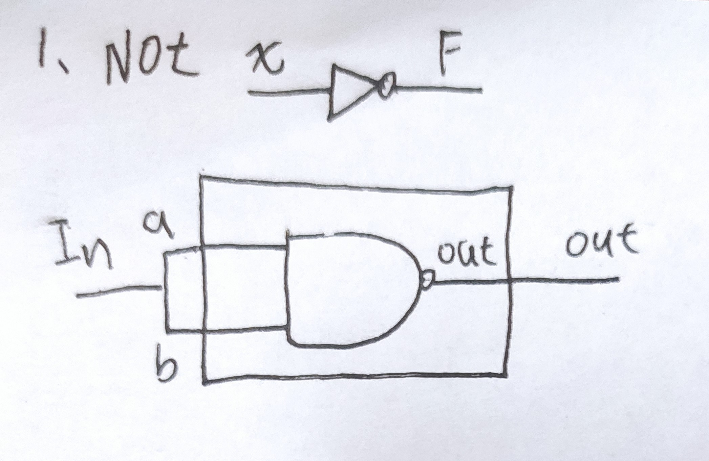
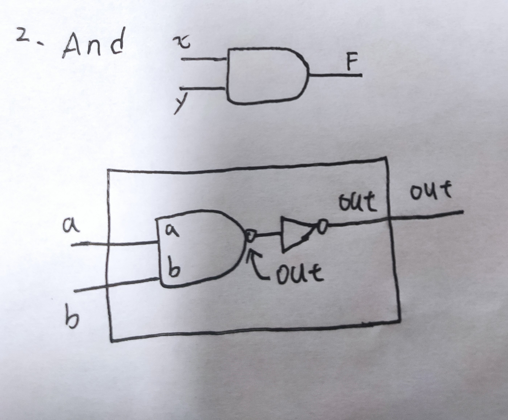
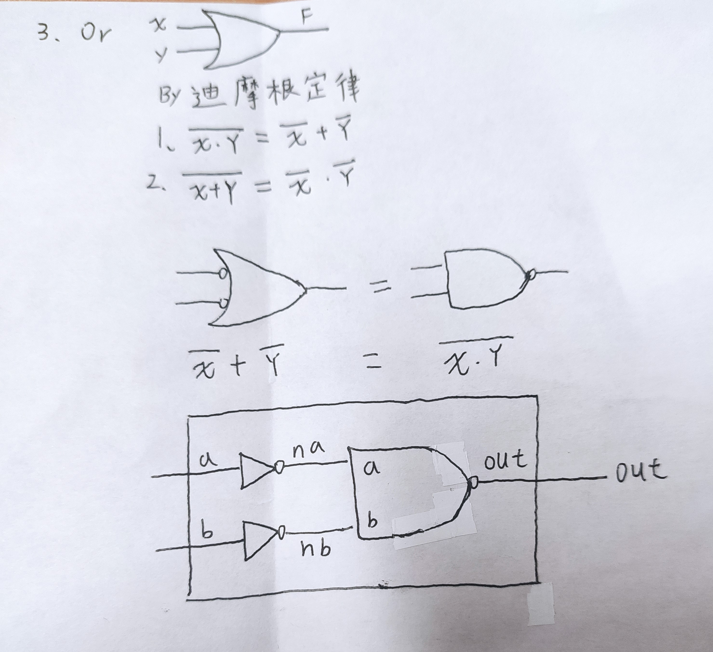
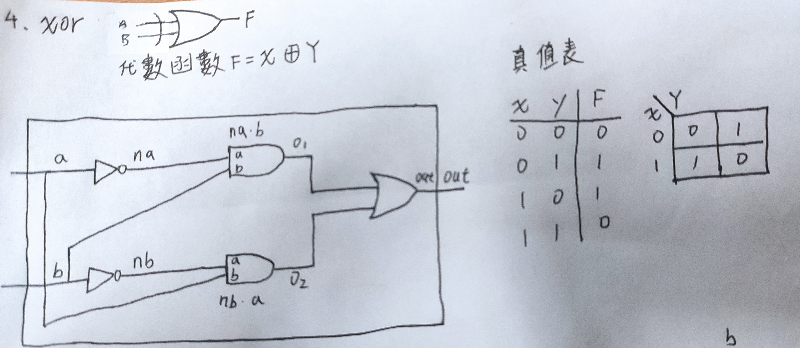
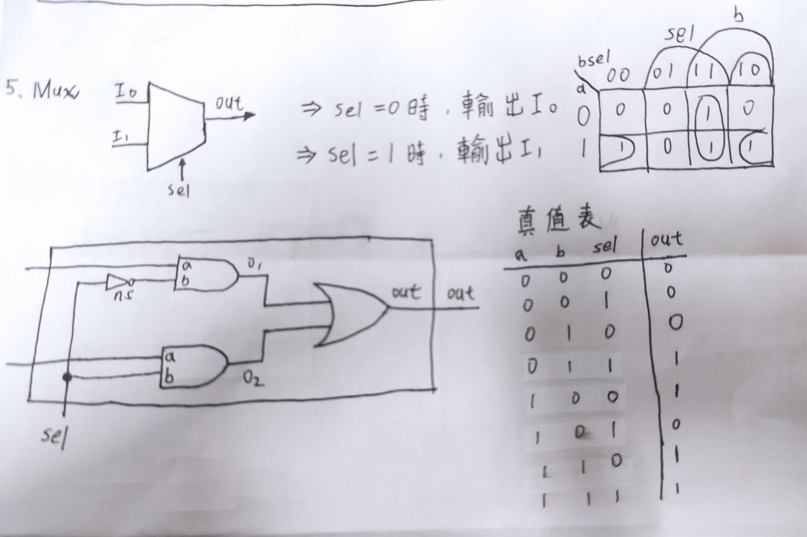
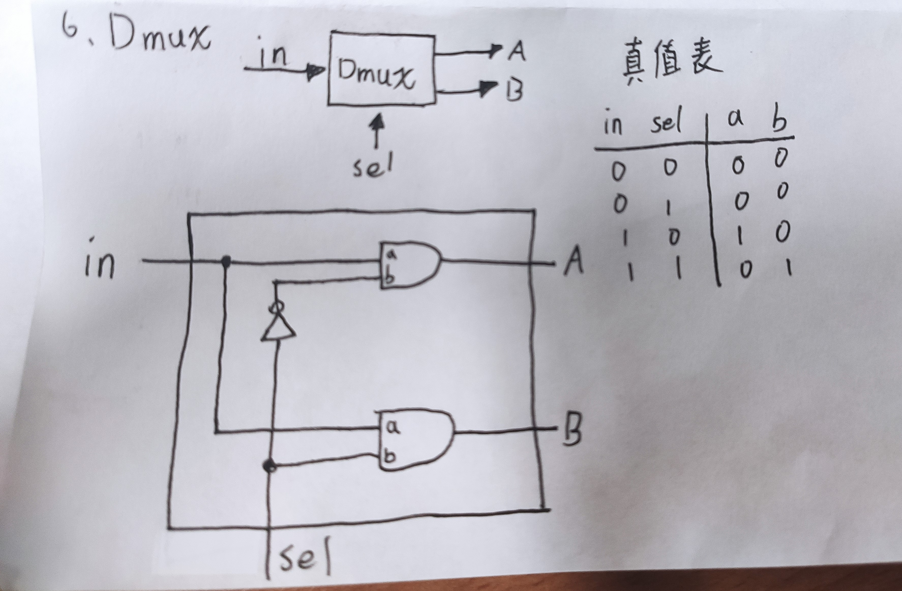

## 第一章前六題(Use Nand to do Not,And,Or，Xor，Mux，DMux)
### 1.Not 

  

* code
```
// This file is part of www.nand2tetris.org
// and the book "The Elements of Computing Systems"
// by Nisan and Schocken, MIT Press.
// File name: projects/01/Not.hdl

/**
 * Not gate:
 * out = not in
 */

CHIP Not {
    IN in;
    OUT out;

    PARTS:
    // Put your code here:
    Nand(a=in, b=in, out=out); //a=in,b=in是內部皆限制外部
}
```
### 2.And




* code
```
// This file is part of www.nand2tetris.org
// and the book "The Elements of Computing Systems"
// by Nisan and Schocken, MIT Press.
// File name: projects/01/And.hdl

/**
 * And gate: 
 * out = 1 if (a == 1 and b == 1)
 *       0 otherwise
 */

CHIP And {  
    IN a, b;
    OUT out;

    PARTS:
    // Put your code here:
    Nand(a=a,b=b,out=AnandB);
    Not(in=AnandB,out=out);
}
```

### 3.Or



* code
```
 // This file is part of www.nand2tetris.org
// and the book "The Elements of Computing Systems"
// by Nisan and Schocken, MIT Press.
// File name: projects/01/Or.hdl

 /**
 * Or gate:
 * out = 1 if (a == 1 or b == 1)
 *       0 otherwise
 */

CHIP Or {
    IN a, b;
    OUT out;

    PARTS:
    // Put your code here:
    Not(in=a,out=na);
    Not(in=b,out=nb);
    Nand(a=na,b=nb,out=out);
}
```

### 4.Xor




* code
```
// This file is part of www.nand2tetris.org
// and the book "The Elements of Computing Systems"
// by Nisan and Schocken, MIT Press.
// File name: projects/01/Xor.hdl

/**
 * Exclusive-or gate:
 * out = not (a == b)
 */

CHIP Xor {
    IN a, b;
    OUT out;

    PARTS:
    // Put your code here:
    Not(in=a,out=na);
	Not(in=b,out=nb);
	And(a=na,b=b,out=o1);
	And(a=a,b=nb,out=o2);
	Or(a=o1,b=o2,out=out);
}
```
### 5.Mux



* code 
```
// This file is part of www.nand2tetris.org
// and the book "The Elements of Computing Systems"
// by Nisan and Schocken, MIT Press.
// File name: projects/01/Mux.hdl

/** 
 * Multiplexor:
 * out = a if sel == 0
 *       b otherwise
 */

CHIP Mux {
    IN a, b, sel;
    OUT out;

    PARTS:
    // Put your code here:
    Not(in=sel,out=ns);
    And(a=a,b=ns,out=o1);
    And(a=b,b=sel,out=o2);
    Or(a=o1,b=o2,out=out);.
     
}
```
### 6.DMux




* code
```
// This file is part of www.nand2tetris.org
// and the book "The Elements of Computing Systems"
// by Nisan and Schocken, MIT Press.
// File name: projects/01/DMux.hdl

/**
 * Demultiplexor:
 * {a, b} = {in, 0} if sel == 0
 *          {0, in} if sel == 1
 */

CHIP DMux {
    IN in, sel;
    OUT a, b;

    PARTS:
    // Put your code here:
    Not(in=sel,out=nsel);
    And(a=in,b=nsel,out=a);
    And(a=in,b=sel,out=b);
}
``` 