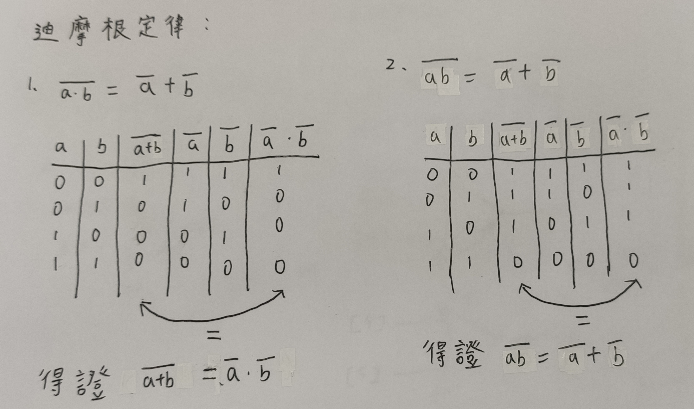
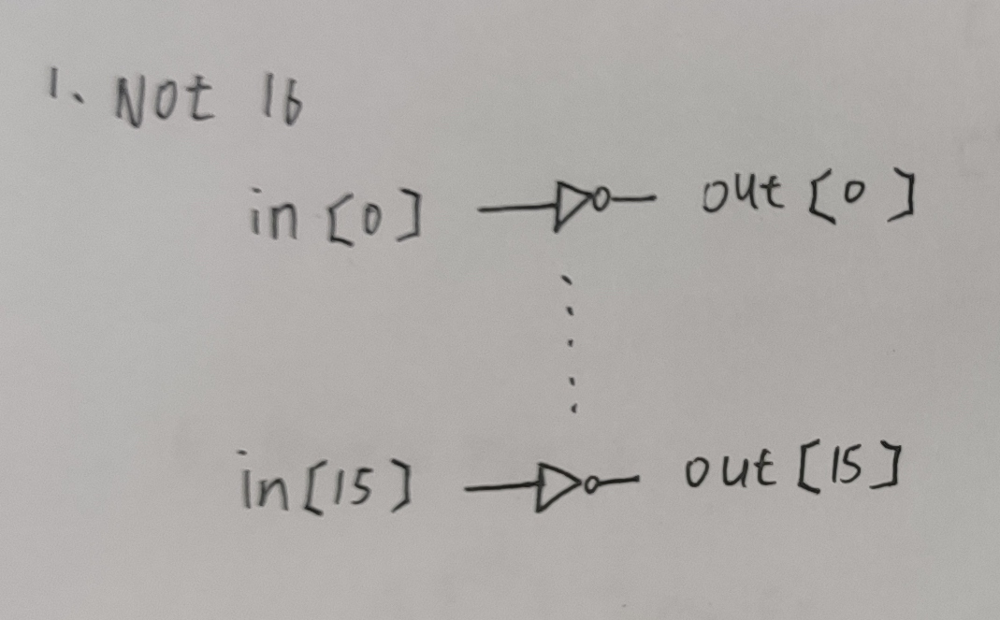
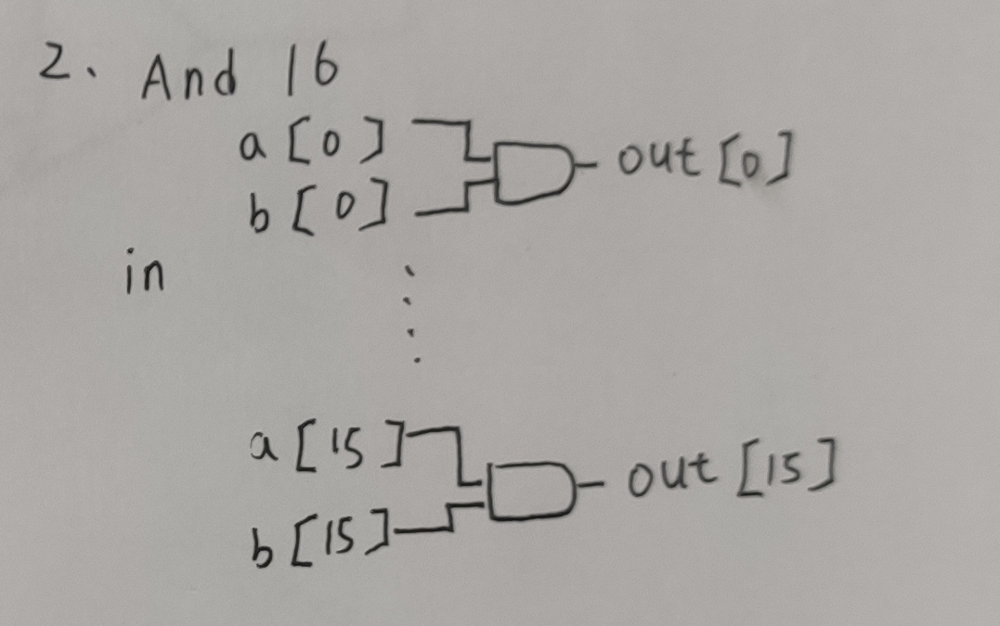
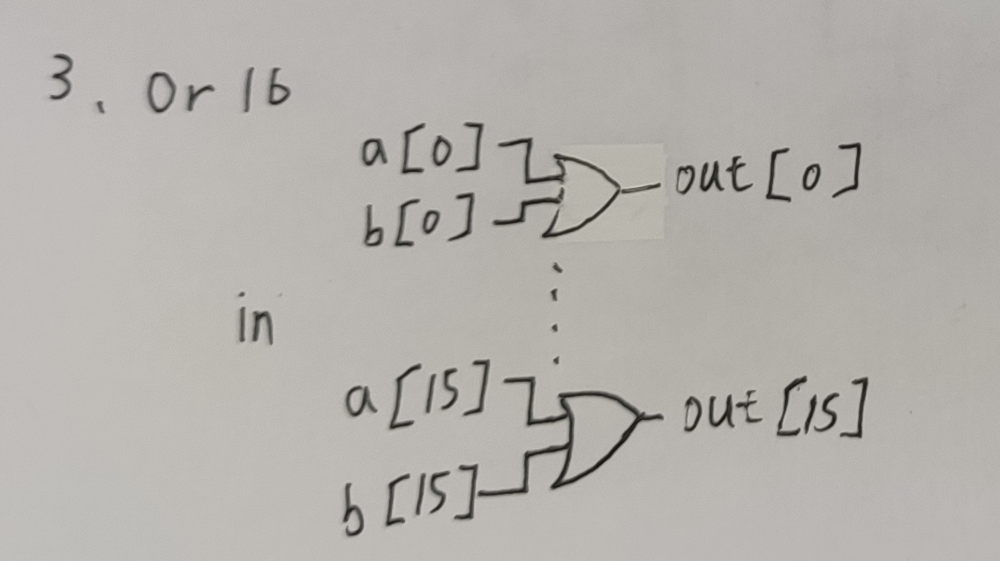
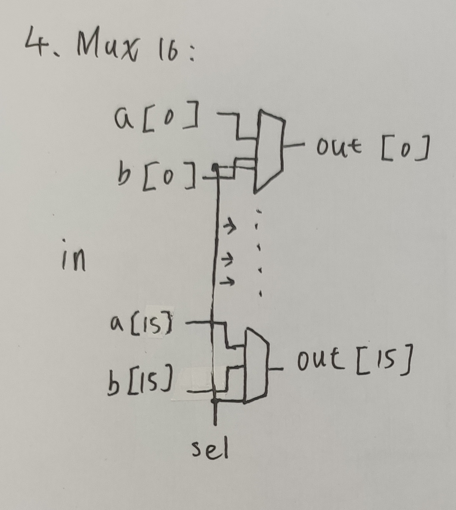
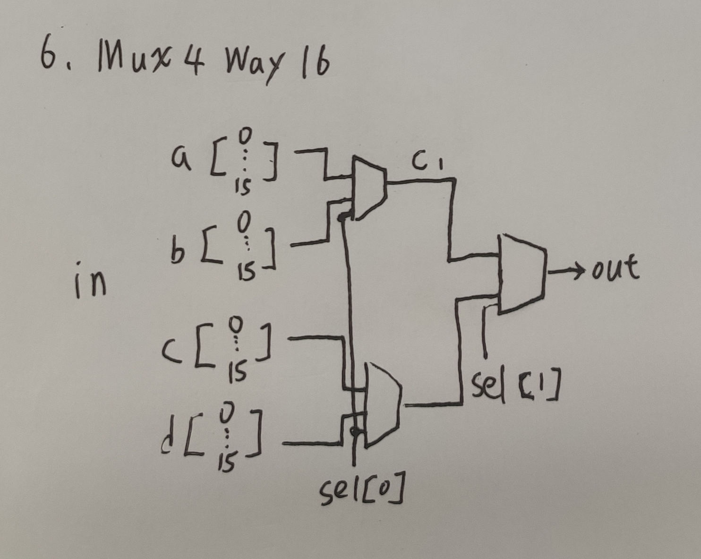
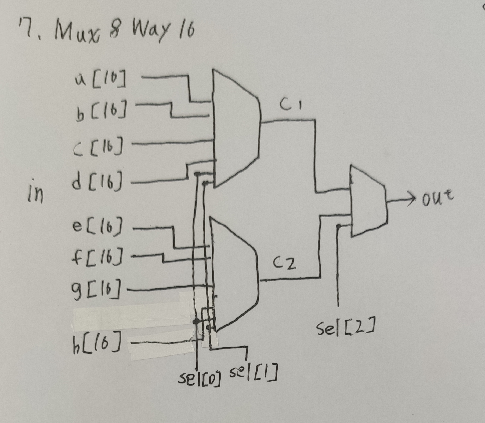
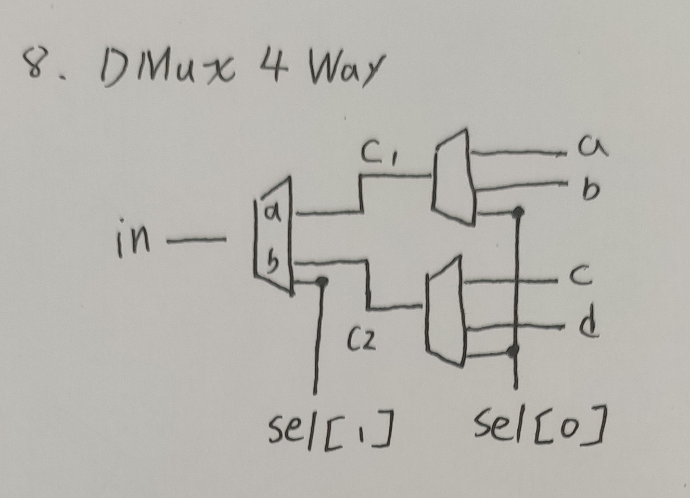
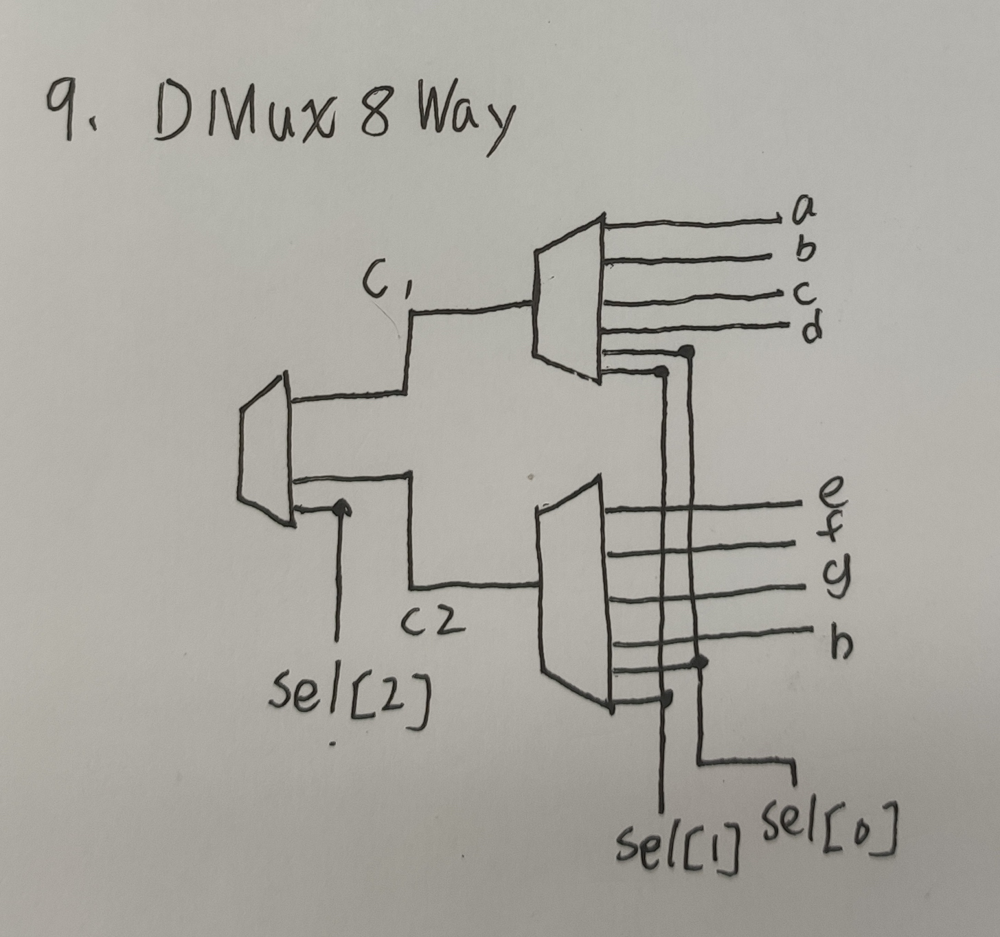

## 迪摩根定理證明


## 第一章剩下的題目
## Not16
* 圖片
  

* 程式碼
```

/**
 * 16-bit Not:
 * for i=0..15: out[i] = not in[i]
 */

CHIP Not16 {
    IN in[16];
    OUT out[16];

    PARTS:
    // Put your code here:
    Not(in=in[0],out=out[0]);
    Not(in=in[1],out=out[1]);
    Not(in=in[2],out=out[2]);
    Not(in=in[3],out=out[3]);
    Not(in=in[4],out=out[4]);
    Not(in=in[5],out=out[5]);
    Not(in=in[6],out=out[6]);
    Not(in=in[7],out=out[7]);
    Not(in=in[8],out=out[8]);
    Not(in=in[9],out=out[9]);
    Not(in=in[10],out=out[10]);
    Not(in=in[11],out=out[11]);
    Not(in=in[12],out=out[12]);
    Not(in=in[13],out=out[13]);
    Not(in=in[14],out=out[14]);
    Not(in=in[15],out=out[15]);
}
```
## And16
* 圖片
 

* 程式碼
```
// This file is part of www.nand2tetris.org
// and the book "The Elements of Computing Systems"
// by Nisan and Schocken, MIT Press.
// File name: projects/01/And16.hdl

/**
 * 16-bit bitwise And:
 * for i = 0..15: out[i] = (a[i] and b[i])
 */

CHIP And16 {
    IN a[16], b[16];
    OUT out[16];

    PARTS:
    // Put your code here:
    And(a=a[0],b=b[0],out=out[0]);
    And(a=a[1],b=b[1],out=out[1]);
    And(a=a[2],b=b[2],out=out[2]);
    And(a=a[3],b=b[3],out=out[3]);
    And(a=a[4],b=b[4],out=out[4]);
    And(a=a[5],b=b[5],out=out[5]);
    And(a=a[6],b=b[6],out=out[6]);
    And(a=a[7],b=b[7],out=out[7]);
    And(a=a[8],b=b[8],out=out[8]);
    And(a=a[9],b=b[9],out=out[9]);
    And(a=a[10],b=b[10],out=out[10]);
    And(a=a[11],b=b[11],out=out[11]);
    And(a=a[12],b=b[12],out=out[12]);
    And(a=a[13],b=b[13],out=out[13]);
    And(a=a[14],b=b[14],out=out[14]);
    And(a=a[15],b=b[15],out=out[15]);
}
```
## Or16
* 圖片
 

* 程式碼
```

/**
 * 16-bit bitwise Or:
 * for i = 0..15 out[i] = (a[i] or b[i])
 */

CHIP Or16 {
    IN a[16], b[16];
    OUT out[16];

    PARTS:
    // Put your code here:
    Or(a=a[0],b=b[0],out=out[0]);
    Or(a=a[1],b=b[1],out=out[1]);
    Or(a=a[2],b=b[2],out=out[2]);
    Or(a=a[3],b=b[3],out=out[3]);
    Or(a=a[4],b=b[4],out=out[4]);
    Or(a=a[5],b=b[5],out=out[5]);
    Or(a=a[6],b=b[6],out=out[6]);
    Or(a=a[7],b=b[7],out=out[7]);
    Or(a=a[8],b=b[8],out=out[8]);
    Or(a=a[9],b=b[9],out=out[9]);
    Or(a=a[10],b=b[10],out=out[10]);
    Or(a=a[11],b=b[11],out=out[11]);
    Or(a=a[12],b=b[12],out=out[12]);
    Or(a=a[13],b=b[13],out=out[13]);
    Or(a=a[14],b=b[14],out=out[14]);
    Or(a=a[15],b=b[15],out=out[15]);
}
```
## Mux16
* 圖片
 

* 程式碼
```
/**
 * 16-bit multiplexor: 
 * for i = 0..15 out[i] = a[i] if sel == 0 
 *                        b[i] if sel == 1
 */

CHIP Mux16 {
    IN a[16], b[16], sel;
    OUT out[16];

    PARTS:
    // Put your code here:
    Mux(a=a[0],b=b[0],sel=sel,out=out[0]);
    Mux(a=a[1],b=b[1],sel=sel,out=out[1]);
    Mux(a=a[2],b=b[2],sel=sel,out=out[2]);
    Mux(a=a[3],b=b[3],sel=sel,out=out[3]);
    Mux(a=a[4],b=b[4],sel=sel,out=out[4]);
    Mux(a=a[5],b=b[5],sel=sel,out=out[5]);
    Mux(a=a[6],b=b[6],sel=sel,out=out[6]);
    Mux(a=a[7],b=b[7],sel=sel,out=out[7]);
    Mux(a=a[8],b=b[8],sel=sel,out=out[8]);
    Mux(a=a[9],b=b[9],sel=sel,out=out[9]);
    Mux(a=a[10],b=b[10],sel=sel,out=out[10]);
    Mux(a=a[11],b=b[11],sel=sel,out=out[11]);
    Mux(a=a[12],b=b[12],sel=sel,out=out[12]);
    Mux(a=a[13],b=b[13],sel=sel,out=out[13]);
    Mux(a=a[14],b=b[14],sel=sel,out=out[14]);
    Mux(a=a[15],b=b[15],sel=sel,out=out[15]);
}
```
## Or8Way
* 圖片


* 程式碼
```
// This file is part of www.nand2tetris.org
// and the book "The Elements of Computing Systems"
// by Nisan and Schocken, MIT Press.
// File name: projects/01/Or8Way.hdl

/**
 * 8-way Or: 
 * out = (in[0] or in[1] or ... or in[7])
 */

CHIP Or8Way {
    IN in[8];
    OUT out;

    PARTS:
    // Put your code here:
     Or(a=in[0],b=in[1],out=Or01);
     Or(a=in[2],b=in[3],out=Or23);
     Or(a=in[4],b=in[5],out=Or45);
     Or(a=in[6],b=in[7],out=Or67);
     Or(a=Or01,b=Or23,out=Or0123);
     Or(a=Or45,b=Or67,out=Or4567);
     Or(a=Or0123,b=Or4567,out=out);
}
```
## Mux4Way16
* 圖片


* 程式碼
```
/**
 * 4-way 16-bit multiplexor:
 * out = a if sel == 00
 *       b if sel == 01
 *       c if sel == 10
 *       d if sel == 11
 */

CHIP Mux4Way16 {
    IN a[16], b[16], c[16], d[16], sel[2];
    OUT out[16];

    PARTS:
    // Put your code here:
    Mux16(a=a,b=b,sel=sel[0],out=Muxab);
    Mux16(a=c,b=d,sel=sel[0],out=Muxcd);
    Mux16(a=Muxab,b=Muxcd,sel=sel[1],out=out);
}
```
## Mux8Way16
* 圖片


* 程式碼
```

/**
 * 8-way 16-bit multiplexor:
 * out = a if sel == 000
 *       b if sel == 001
 *       etc.
 *       h if sel == 111
 */

CHIP Mux8Way16 {
    IN a[16], b[16], c[16], d[16],
       e[16], f[16], g[16], h[16],
       sel[3];
    OUT out[16];

    PARTS:
    // Put your code here:
    Mux4Way16(a=a,b=b,c=c,d=d,sel=sel[0..1],out=Mux4abcd);
    Mux4Way16(a=e,b=f,c=g,d=h,sel=sel[0..1],out=Mux4efgh);
    Mux16(a=Mux4abcd,b=Mux4efgh,sel=sel[2],out=out);
}
```
## DMux4Way
* 圖片


* 程式碼
```

/**
 * 4-way demultiplexor:
 * {a, b, c, d} = {in, 0, 0, 0} if sel == 00
 *                {0, in, 0, 0} if sel == 01
 *                {0, 0, in, 0} if sel == 10
 *                {0, 0, 0, in} if sel == 11
 */

CHIP DMux4Way {
    IN in, sel[2];
    OUT a, b, c, d;

    PARTS:
    // Put your code here:
    DMux(in=in,sel=sel[1],a=Duxa,b=Duxb);
    DMux(in=Duxa,sel=sel[0],a=a,b=b);
    DMux(in=Duxb,sel=sel[0],a=c,b=d);
} 
```
## DMux8Way
* 圖片


* 程式碼
```

/**
 * 8-way demultiplexor:
 * {a, b, c, d, e, f, g, h} = {in, 0, 0, 0, 0, 0, 0, 0} if sel == 000
 *                            {0, in, 0, 0, 0, 0, 0, 0} if sel == 001
 *                            etc.
 *                            {0, 0, 0, 0, 0, 0, 0, in} if sel == 111
 */

CHIP DMux8Way{
    IN in, sel[3];
    OUT a, b, c, d, e, f, g, h;

    PARTS:
    // Put your code here:
    DMux(in=in,sel=sel[2],a=aDMux,b=bDMux);
    DMux4Way(in=aDMux,sel=sel[0..1],a=a,b=b,c=c,d=d);
    DMux4Way(in=bDMux,sel=sel[0..1],a=e,b=f,c=g,d=h);
}
```


