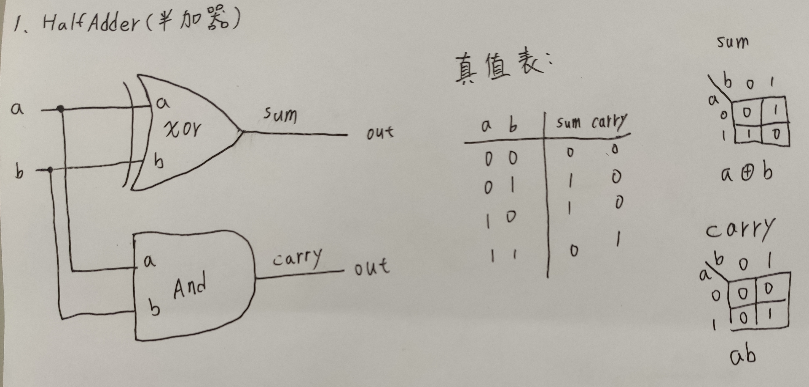
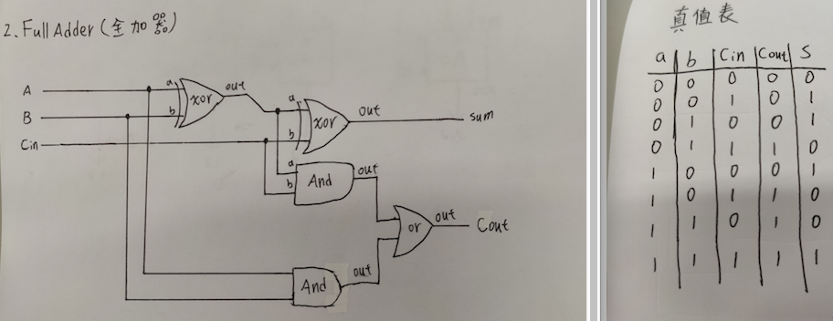
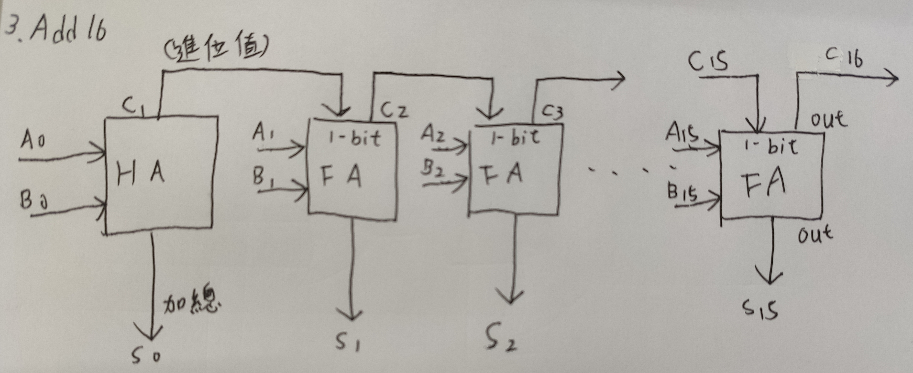
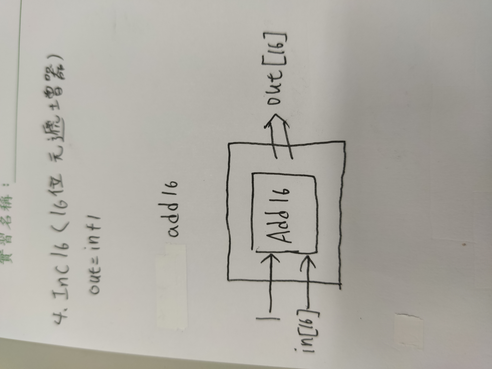

### 1.HalfAdder 
* picture
  


* 程式碼
```

/**
 * Computes the sum of two bits.
 */

CHIP HalfAdder {
    IN a, b;    // 1-bit inputs
    OUT sum,    // Right bit of a + b 
        carry;  // Left bit of a + b

    PARTS:
    // Put you code here:
    Xor(a=a,b=b,out=sum);
    And(a=a,b=b,out=carry);
}

```
### 2.FullAdder
* picture
 
 

* 程式碼
```

/**
 * Computes the sum of three bits.
 */

CHIP FullAdder {
    IN a, b, c;  // 1-bit inputs
    OUT sum,     // Right bit of a + b + c
        carry;   // Left bit of a + b + c

    PARTS:
    // Put you code here:
    And(a=a,b=b,out=Andab);
    And(a=a,b=c,out=Andac);
    And(a=b,b=c,out=Andbc);
    Or(a=Andab,b=Andac,out=Orabac);
    Or(a=Orabac,b=Andbc,out=carry);
    Xor(a=a,b=b,out=Xab);
    Xor(a=Xab,b=c,out=sum);
}

```
### 3.Add16
* picture
  
 

* 程式碼
```

/**
 * Adds two 16-bit values.
 * The most significant carry bit is ignored.
 */

CHIP Add16 {
    IN a[16], b[16];
    OUT out[16];

    PARTS:
   // Put you code here:
   FullAdder(a=a[0],b=b[0],c=false,sum=out[0],carry=c1);
   //HalfAdder(a=a[0],b=b[0],sum=out[0],carry=c1);
   FullAdder(a=a[1],b=b[1],c=c1,sum=out[1],carry=c2);
   FullAdder(a=a[2],b=b[2],c=c2,sum=out[2],carry=c3);
   FullAdder(a=a[3],b=b[3],c=c3,sum=out[3],carry=c4);
   FullAdder(a=a[4],b=b[4],c=c4,sum=out[4],carry=c5);
   FullAdder(a=a[5],b=b[5],c=c5,sum=out[5],carry=c6);
   FullAdder(a=a[6],b=b[6],c=c6,sum=out[6],carry=c7);
   FullAdder(a=a[7],b=b[7],c=c7,sum=out[7],carry=c8);
   FullAdder(a=a[8],b=b[8],c=c8,sum=out[8],carry=c9);
   FullAdder(a=a[9],b=b[9],c=c9,sum=out[9],carry=c10);
   FullAdder(a=a[10],b=b[10],c=c10,sum=out[10],carry=c11);
   FullAdder(a=a[11],b=b[11],c=c11,sum=out[11],carry=c12);
   FullAdder(a=a[12],b=b[12],c=c12,sum=out[12],carry=c13);
   FullAdder(a=a[13],b=b[13],c=c13,sum=out[13],carry=c14);
   FullAdder(a=a[14],b=b[14],c=c14,sum=out[14],carry=c15);
   FullAdder(a=a[15],b=b[15],c=c15,sum=out[15],carry=c16);
}

```
### Inc16
* picture



* 程式碼
```

/**
 * 16-bit incrementer:
 * out = in + 1 (arithmetic addition)
 */

CHIP Inc16 {
    IN in[16];
    OUT out[16];

    PARTS:
   // Put you code here:
   //Add16
   Add16(a=in,b[0]=true,b[1..15]=false,out=out);
}
```
