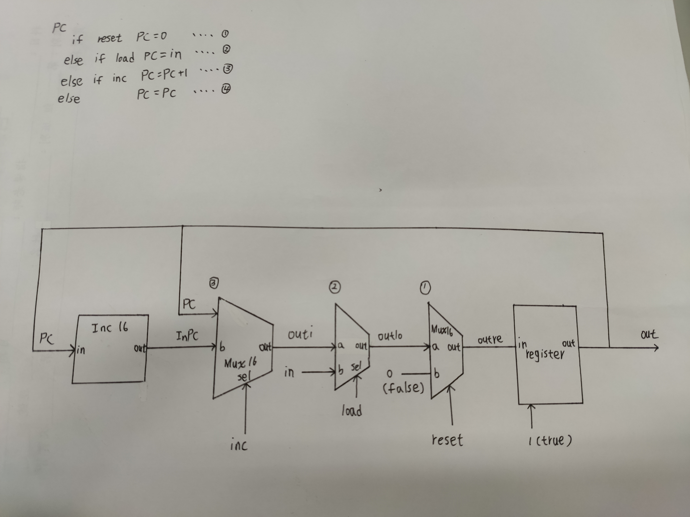

### PC
* picture


* code
```
/**
 * A 16-bit counter with load and reset control bits.
 * if      (reset[t] == 1) out[t+1] = 0
 * else if (load[t] == 1)  out[t+1] = in[t]
 * else if (inc[t] == 1)   out[t+1] = out[t] + 1  (integer addition)
 * else                    out[t+1] = out[t]
 */

CHIP PC {
    IN in[16],load,inc,reset;
    OUT out[16];

    PARTS:
    // Put your code here:
    Inc16(in=PC,out=InPC);
    Mux16(a=PC,b=InPC,sel=inc,out=outi);
    Mux16(a=outi,b=in,sel=load,out=outlo);
    Mux16(a=outlo,b=false,sel=reset,out=outre);
    Register(in=outre,load=true,out=PC,out=out);
}
```
