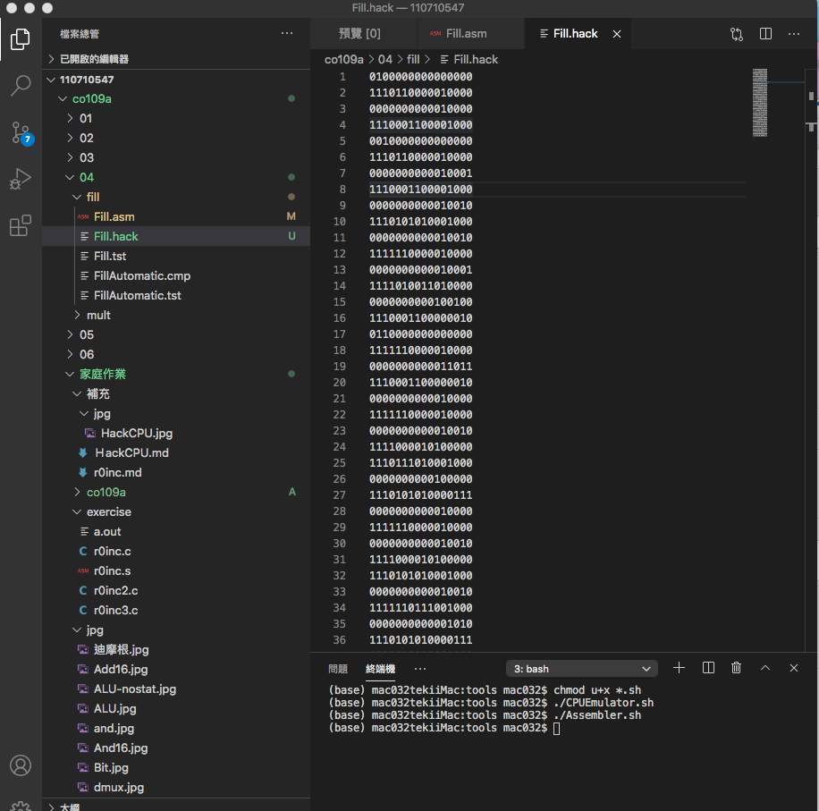
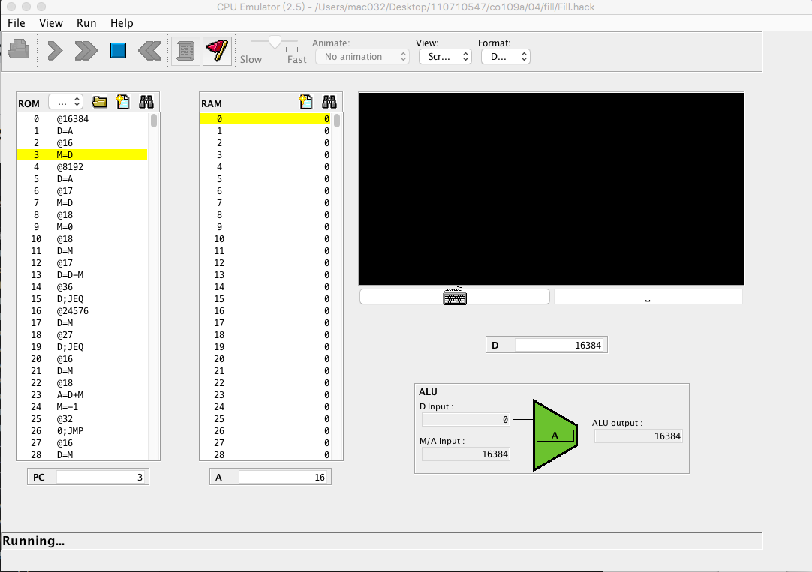

```
// --------------------------
// 類似 Ｃ語言的高階寫法
// forever
//   arr = SCREEN
//   n = 8192
//   i = 0
//   while (i < n) {
//     if (*KBD != 0)
//       arr[i] = -1
//     else
//       arr[i] = 0
//     i = i + 1
//   }
// goto forever;
// --------------------------
// 類似 Ｃ語言的低階寫法
// arr = SCREEN
// n=8192
// FOREVER:
// loop:
//   if (i==n) goto ENDLOOP
//   if (*KBD != 0)
//     RAM[arr+i] = -1
//   else
//     RAM[arr+i] = 0
//   i++
// goto loop
// ENDLOOP:
// goto FOREVER
// --------------------------

(FOREVER)
// arr = SCREEN
@SCREEN
D=A
@arr
M=D

// n=8192
@8192
D=A
@n
M=D
// i = 0
@i
M=0
(LOOP)
  // if (i==n) goto ENDLOOP
@i
D=M
@n
D=D-M
@ENDLOOP
D; JEQ

  // if (*KBD != 0)
@KBD
D=M     // D = *KBD
@ELSE
D; JEQ  // if (*KDB==0) goto ELSE

//   RAM[arr+i] = -1
@arr
D=M
@i
A=D+M
M=-1

@ENDIF
0; JMP
(ELSE)
  // else
  //   RAM[arr+i] = 0
@arr
D=M
@i
A=D+M
M=0

(ENDIF)

// i++
@i
M=M+1

@LOOP
0; JMP

(ENDLOOP)
@FOREVER
0; JMP
```

##  Fill hack

## RESULT


